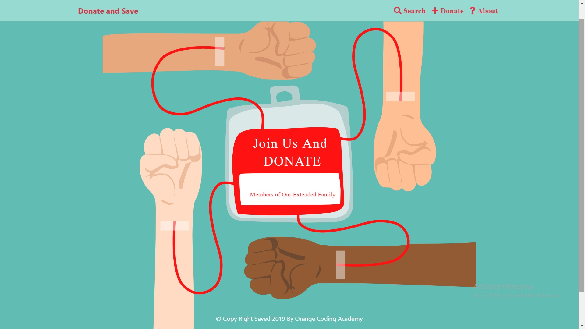
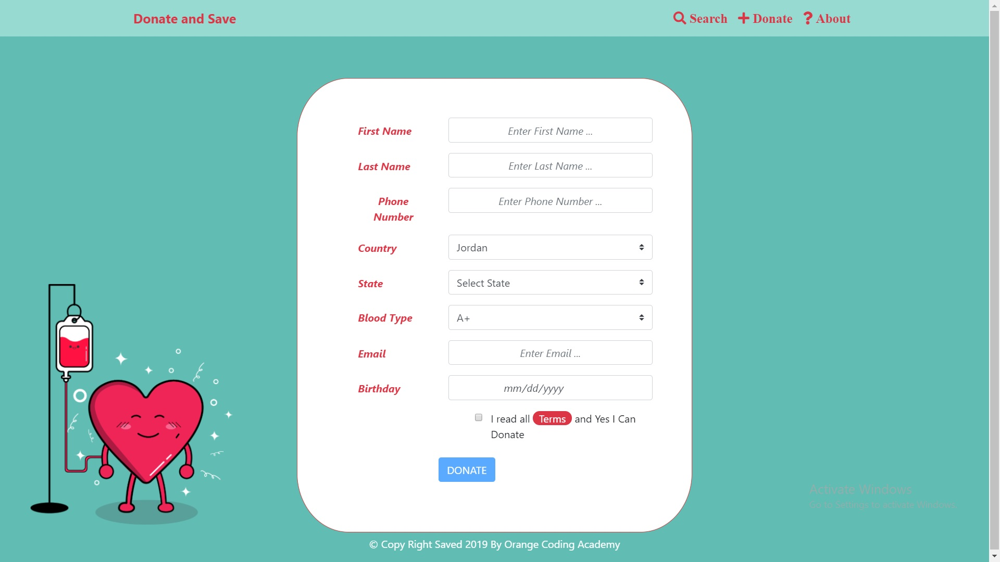

# Donate and Save
## project 4 
you can use single line  **npm run dev** to start react and server in one Terminal

**Our Vision** 
Better health for everyone,every where We seek to reduce the communication gap between donors and donors seeking.So that blood donation becomes easier.

**Built With** 

.React JS
.JScript
.Express
.Mongo DB
.BootStrap
.CSS
.Html

**Getting Started** 

You can use single line  **npm run dev** to start react and server in one Terminal.

**Usage** 

**Home Page** 
  From this page  you can  donate or search for donor or read about us .

**Donate page** 
 You can register as donater by provide us by your information as the picture below.

 **Search Page**  
You can search  about  blood donor by  country,state, and the blood type.

 **About Us page** 
You can read about  our Who we are?,Our Vision,and you can find information to Contact Us .

**Roadmap** 

**Contact** 
Phone: +962-777-522-509
Email: codingacademy.ojo@orange.com

**Our website link**
https://donate-and-save-ojoca.herokuapp.com/about

**Authors**

**naaman Munther** 
*https://github.com/naaman94*

**Doha Dojan**  

*https://github.com/dohadojan*

**Rawabi Okour**

*https://github.com/RawabiFOkour*

**Rashed Magdadi**

*https://github.com/RashedMigdady*

